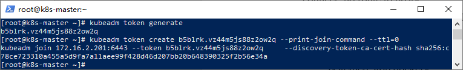

# 目录
### 部分常见问题处理

- Coredns CrashLoopBackOff 导致无法成功添加工作节点的问题
- 添加工作节点时提示token过期
- kubectl 执行命令报“The connection to the server localhost:8080 was refused”
- 网络组件flannel无法完成初始化
- 部分节点无法启动pod
-------------------------------------------------
#### Coredns CrashLoopBackOff 导致无法成功添加工作节点的问题

k8s集群安装完成之后，当我们添加工作节点时，可能会在长久的等待之中而无任何进展，这时可以使用以下命令来查看k8s各个服务的状态：

    kubectl get pods -n kube-system -o wide


初步诊断容器崩溃，我们需要进一步查看日志，使用“kubectl logs”：

    kubectl log -f coredns-5c98db65d4-8wt9z -n kube-system
这次我们获得了以下具体错误：

    github.com/coredns/coredns/plugin/kubernetes/controller.go:322: Failed to list *v1.Namespace: Get https://10.96.0.1:443/api/v1/namespaces?limit=500&resourceVersion=0: dial tcp 10.96.0.1:443: connect: no route to host
#### 解决方案：

这问题很有可能是防火墙（iptables）规则错乱或者缓存导致的，可以依次执行以下命令进行解决：
```
systemctl stop kubelet
systemctl stop docker
iptables --flush
iptables -tnat --flush
systemctl start kubelet
systemctl start docker
```
#### 添加工作节点时提示token过期

集群注册token的有效时间为24小时，如果集群创建完成后没有及时添加工作节点，那么我们需要重新生成token。相关命令如下所示：

#生成token

    kubeadm token generate
#根据token输出添加命令

    kubeadm token create <token> --print-join-command --ttl=0



然后仅需复制打印出来的命令到工作节点执行即可。

##### kubectl 执行命令报“The connection to the server localhost:8080 was refused”
作为集群管理的核心，工作节点上的kubectl可能一上来就跪了，如下图所示：


出现这个问题的原因是kubectl命令需要使用kubernetes-admin的身份来运行，在“kubeadm int”启动集群的步骤中就生成了“/etc/kubernetes/admin.conf”。

因此，解决方法如下，将主节点中的【/etc/kubernetes/admin.conf】文件拷贝到工作节点相同目录下：
```
#复制admin.conf，请在主节点服务器上执行此命令
scp /etc/kubernetes/admin.conf 172.16.2.202:/etc/kubernetes/admin.conf
scp /etc/kubernetes/admin.conf 172.16.2.203:/etc/kubernetes/admin.conf
```


然后分别在工作节点上配置环境变量：
```
#设置kubeconfig文件
export KUBECONFIG=/etc/kubernetes/admin.conf
echo "export KUBECONFIG=/etc/kubernetes/admin.conf" >> ~/.bash_profile
```
接下来，工作节点就正常了，如：


#### 网络组件flannel无法完成初始化

网络组件flannel安装完成后，通过命令查看时一直在初始化状态，并且通过日志输出内容如下所示：
```
kubectl get pods -n kube-system -o wide
kubectl logs -f kube-flannel-ds-amd64-hl89n -n kube-system
```


##### 具体错误日志为：

    Error from server: Get https://172.16.2.203:10250/containerLogs/kube-system/kube-flannel-ds-amd64-hl89n/kube-flannel?follow=true: dial tcp 172.16.2.203:10250: connect: no route to host
这时，我们可以登录节点所在的服务器，使用以下命令来查看目标节点上的kubelet日志：

    journalctl -u kubelet -f
- 注意：journalctl工具可以查看所有日志，包括内核日志和应用日志。


通过日志，我们发现是镜像拉取的问题。对此，大家可以参考上文中镜像拉取的方式以及重命名镜像标签来解决此问题，当然也可以通过设置代理来解决此问题。

#### 部分节点无法启动pod

有时候，我们部署了应用之后，发现在部分工作节点上pod无法启动（一直处于ContainerCreating的状态）：


通过排查日志最终我们得到重要信息如下所示：

    NetworkPlugin cni failed to set up pod "demo-deployment-675b5f9477-hdcwg_default" network: failed to set bridge addr: "cni0" already has an IP address different from 10.0.2.1/24
这是由于当前节点之前被反复注册，导致flannel网络出现问题。可以依次执行以下脚本来重置节点并且删除flannel网络来解决：
```
kubeadm reset    #重置节点
systemctl stop kubelet \
 && systemctl stop docker \
 && rm -rf /var/lib/cni/ \
 && rm -rf /var/lib/kubelet/* \
 && rm -rf /var/lib/etcd \
 && rm -rf /etc/cni/ \
 && ifconfig cni0 down \
 && ifconfig flannel.1 down \
 && ifconfig docker0 down \
 && ip link delete cni0 \
 && ip link delete flannel.1
systemctl start docker
```
执行完成后，重新生成token并注册节点即可，具体可以参考上文内容。

在k8s集群的部署过程中或者过后，大家可能会遇到很多问题。这也是本地部署k8s集群遇到的最大的挑战质疑，因此本篇笔者讲述了问题处理思路和常见错误，希望能够给予大家帮助。

如果通过详细异常和和日志还是无法推断出具体错误，建议大家可以根据具体信息在“https://stackoverflow.com”网站上进行搜索，也可以在相关社交网站（比如github）和群里请教，不过请教前，请给出你的诊断步骤和详细的错误日志。
